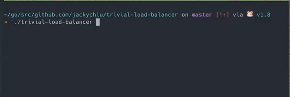

# Load Balancer
In this trivial example the load balancer distributes work across the worker pool by giving tasks to the least loaded worker.

## Demo
The load balancer was tested by a load generator that produces tasks at a inconsistent interval, faster than the time it takes to complete the tasks itself. 
The tasks also take an inconsistent amount of time to finish.
In this example the tasks were just sleeps.

The gif below shows values for:
- `Workers`: Pending requests for worker
- `Avg Load`: Average pending requests for worker pool
- `Std Dev`: Standard deviation of pending requests

The standard deviation measures how spread out the pending requests are across workers, giving us an idea of how well the balancer is distributing requests.
As we can see as time goes by and the average load goes up the standard deviation remains about the same!

**Basically the smaller the `Std Dev` the better work is being distributed!**

## Design

*The design was based off the talk [concurrency is not parallelism](https://www.youtube.com/watch?v=cN_DpYBzKso) by Rob Pike, the diagram is also from there*

1. Requests are made by a requester
1. The Balancer dispatch's requests to a select worker in the worker pool
1. The Worker will execute the task specified by the request 

## Future
In the future I'd like to test this out with a TCP server with real tasks, and do a benchmark then
